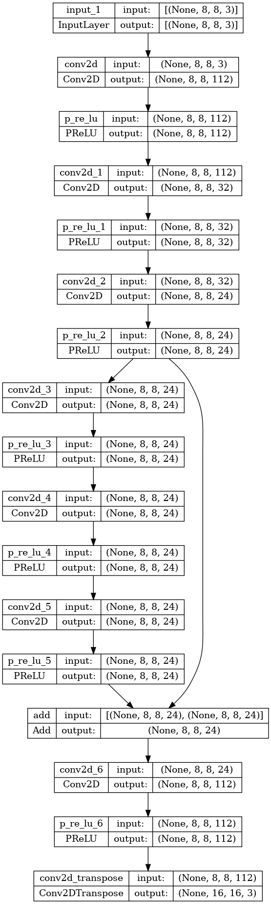

# Introduction
The main idea of this project is to learn how to work with convolutional neural networks. 
By learning to work with CNN I mean working with a dataset(its creation, processing and use for model learning), 
studying different architectures of neural networks, learning the TensorFlow library, specifically the Keras interface, and finally creating a application for improving the resolution of photos based on the received model. 
All the sources that I have used for learning can be find in the References section. 
These sources were either theoretical or practical sources for understanding the basics of Keras.

# Architecture of the neural network(FSRCNN)
The architecture for my model based on FSRCNN. 
I came to the conclusion that this architecture shows very good results and is not demanding on hardware. 
I had to modify this architecture and add some changes, although even with such changes the training was fast enough. 

I would like to say that the final model architecture is the result of a large number of experiments.
## Explanation of the using architecture


# Dataset
At first, I created a script download_image.py to quickly create a large dataset, but I came to the conclusion that it would be better to use a ready-made variant, because my internet speed is not enough.

I downloaded a dataset of 5500 photos from the [ImagesNet](https://www.image-net.org/challenges/LSVRC/2017/2017-downloads.php). 
Then I created a script that transforms all photos to the same format and checks the photos to see if they can be opened. 
Based on the given photos, I then perform photo agmentation (from one photo I make 5 pieces including the original one), so I have used 23000 images to train the model.

# Algorithm of resolution image
I want to repeat, my main goal is to double the resolution of the photo. At first my model took 128*128 pixels photos, but I was not very satisfied with the final result, because the photos were still blurred. 
I tried different CNN architecture and also I used pre-trained models, but the result was similar. 
So I decided that I could divide the picture into equal pieces, increase them, and then merge them all together. 

The advantage of this idea was that we are not tied to the resolution of the original picture ( so we can increase a resolution of any photos), just that the image was more than this small filter. 
As a result, I redesigned the model and now it takes a picture of 8x8 pixels to the input and outputs a picture of 16x16.
The algorithm is that we divide the picture into 8x8 squares (if the resolution does not allow us to divide the picture into squares, we convert to a resolution that allows it), then we pass our squares to the model and merge them together and as a result we get a complete picture. 

I would like to add that this algorithm is not perfect as well, because on photos now you can notice small squares on the background, and also transphomation of the picture now takes more time.
# Results
I would like to say that the results are not perfect, but I am satisfied with them. 
It is worth noting that the model was trained for 20 epochs, and the training time was about 20 minutes.

## Origin image


## Resolution 2x


## Resolution 4x


# Launching application
To launch the application, you need to install all the libraries, you can do this using the command:
```pip install -r requirements.txt```
Model is already trained, so you can use it, and model located in the src folder.
To start the application, you need to run the main.py file, and then choose the image you want to increase the resolution of.
The result will be saved in the output folder.

# File
* `src` - folder with source images
* `main.py` - main file for using model
* `download_image.py` - script for download images from internet 
* `process_image.py` - script for transform images to the same format and agumentation they
* `train_model.py` - script for training model

# Confusion of my pc
 * CPU: Intel Core i7-9750HF  2.60GHz
 * GPU: NVIDIA GeForce GTX 1660 Ti
 * RAM: 16GB

# Using libraries
* [TensorFlow](https://www.tensorflow.org/)
* [Keras](https://keras.io/)
* [OpenCV](https://opencv.org/)
* [Numpy](https://numpy.org/)
* [Pillow](https://pillow.readthedocs.io/en/stable/)

# References
1. [Fast and Accurate Image Super Resolution by Deep CNN
with Skip Connection and Network in Network](https://arxiv.org/ftp/arxiv/papers/1707/1707.05425.pdf)
2. [Image Super-Resolution Using Deep Convolutional Networks](https://arxiv.org/pdf/1501.00092.pdf)
3. [Images-Resolution-Enhancement-Usiung-CNN](https://github.com/ahmadsallakh/Images-Resolution-Enhancement-Usiung-CNN)
4. [Image Super-Resolution Using Deep Convolutional Networks in Tensorflow](https://github.com/tegg89/SRCNN-Tensorflow)